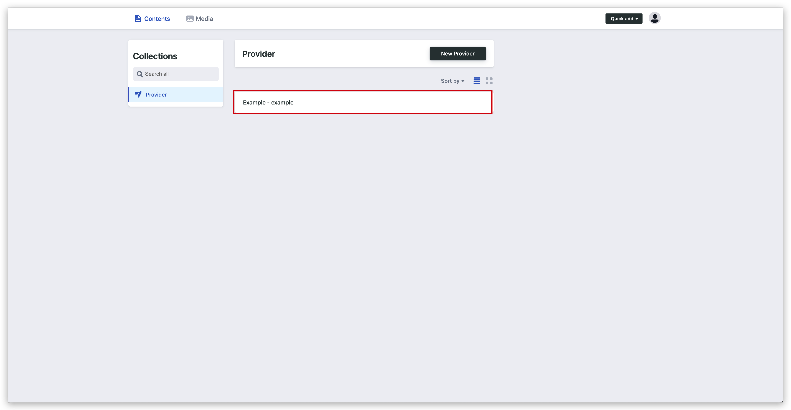
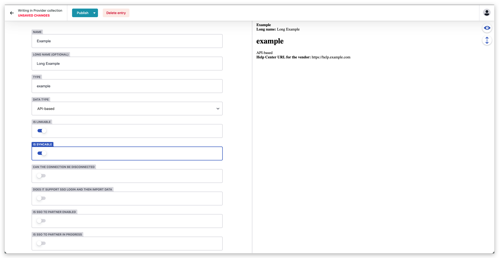
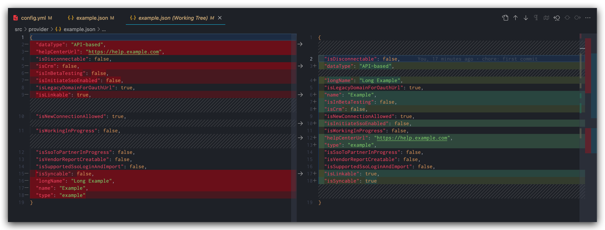

# Decap CMS field sort issue

## Reproduction steps


1. Clone the repository and start it locally
```sh
git@github.com:liby/decap-cms-field-sort-issue.git

cd decap-cms-field-sort-issue

pnpm i // or npm i

pnpm start
```

2. Open **Example** and modify a field at random



3. Click **Publish** to save the changes

4. View file changes locally
